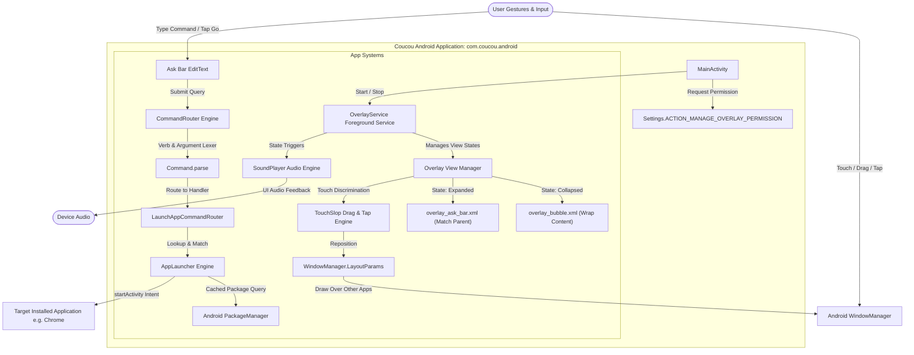
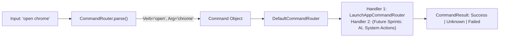

# Coucou Android — System Architecture & How It Works

> Comprehensive technical breakdown and user guide for the **Coucou Android** floating assistant and launcher application (`com.coucou.android`).

---

## 1. Overview & Concept

**Coucou Android** is an interactive, always-accessible floating overlay assistant for Android. Inspired by the desktop companion [NotchBuddy / Coucou](https://github.com/Louis-CFM/coucou), Coucou Android brings that experience to mobile devices as a lightweight, floating circular bubble that lives on top of whatever application is active (Settings, Chrome, social apps, home launcher, etc.).

### Primary Capabilities
- 🫧 **Persistent Floating Overlay:** Stays visible and responsive over other running applications and the Android home screen.
- 👆 **Fluid Gesture Handling:** Smooth drag-to-reposition anywhere on screen; distinct tap gesture to expand or collapse.
- ⚡ **Instant App Launcher & Command Router:** Type an application name (e.g. `chrome`, `settings`, `camera`, or `open maps`) into the expandable Ask Bar to instantly jump directly to that app.
- 🔍 **Fuzzy Multi-Tiered Matching:** Resolves app names by exact match, package name, prefix, substring, or word boundaries with shortest-label tie breaking.
- 🔊 **Event-Driven Audio Subsystem:** Sound hooks wired to lifecycle and interaction points (greet, expand, collapse, launch success, error) with runtime name resolution and zero-crash fallbacks.
- 🛡️ **Robust Android 14+ Lifecycle Architecture:** Complies with modern Android foreground service restrictions, system alert window permissions, and theme isolation.

---

## 2. High-Level Architecture

The following diagram illustrates how the core subsystems of Coucou Android interact with the Android OS, the user, and target applications:



---

## 3. Core App Systems Breakdown

Coucou Android is architected into five decoupled subsystems:

```
coucou-android/app/src/main/java/com/coucou/android/
├── MainActivity.kt        # System 1: Host Activity & Permission Management
├── OverlayService.kt      # System 2: Floating Window Overlay & Gesture Lifecycle
├── CommandRouter.kt       # System 3: Natural Language Command & Dispatch Pipeline
├── AppLauncher.kt         # System 4: App Resolution & Launching Engine
└── SoundPlayer.kt         # System 5: Event-Driven Low-Latency Audio Subsystem
```

---

### System 1: Host Activity & Permission Manager (`MainActivity.kt`)

The host activity provides the bootstrap UI where the user manages permissions and turns the floating overlay on or off.

```
       [MainActivity]
             │
      Has Permission?
       ├── No  ──► Launch Settings.ACTION_MANAGE_OVERLAY_PERMISSION
       └── Yes ──► Start OverlayService via ContextCompat.startForegroundService
```

1. **System Alert Window Permission Flow:**
   - Under Android, drawing over other applications requires the privileged permission `android.permission.SYSTEM_ALERT_WINDOW`.
   - Android 10+ strictly prohibits apps from granting this automatically. The app verifies permission using `Settings.canDrawOverlays(context)`.
   - If missing, the app triggers an intent to `Settings.ACTION_MANAGE_OVERLAY_PERMISSION` targeted to `package:com.coucou.android`, directing the user directly to the toggle screen in system settings.
2. **Dynamic UI State Reflection:**
   - On returning to the activity (`onResume`), the UI checks permission and service status (`OverlayService.isRunning`), automatically updating button states and visibility.
3. **Service Control:**
   - Launches `OverlayService` with `ACTION_START` via `ContextCompat.startForegroundService`.
   - Stops the service with `ACTION_STOP`.

---

### System 2: Floating Window Overlay & Lifecycle (`OverlayService.kt`)

`OverlayService` is the heart of the application. It runs as an ongoing Android Foreground Service to prevent OS killing, and manages the actual window overlay.

#### 1. Window Type & Flag Strategy
- **Window Type:** Uses `WindowManager.LayoutParams.TYPE_APPLICATION_OVERLAY` (API 26+) with a legacy fallback to `TYPE_PHONE`.
- **Dual-State Geometry & Flag Switching:**
  - **Collapsed State (The Bubble):**
    - Layout: `res/layout/overlay_bubble.xml`
    - Width / Height: `WRAP_CONTENT`
    - Flags: Includes `FLAG_NOT_FOCUSABLE` and `FLAG_WATCH_OUTSIDE_TOUCH`.
    - *Why this matters:* Keeping width as `WRAP_CONTENT` ensures the window only consumes touch events on the circular bubble itself. The rest of the screen remains completely clickable for the app underneath.
  - **Expanded State (The Ask Bar):**
    - Layout: `res/layout/overlay_ask_bar.xml`
    - Width: `MATCH_PARENT` (fills screen width)
    - Flags: Strips `FLAG_NOT_FOCUSABLE` (`flags and FLAG_NOT_FOCUSABLE.inv()`).
    - Soft Input Mode: `SOFT_INPUT_ADJUST_NOTHING`.
    - *Why this matters:* The `EditText` inside the Ask Bar requires window focus to receive software keyboard (IME) input. When expanded, the focus flag is enabled and the keyboard is requested via `InputMethodManager`.

#### 2. Touch Slop & Drag-vs-Tap Discrimination
When the user places a finger on the bubble, the service must distinguish whether the user intends to **drag** the bubble to a new position, or **tap** to expand the Ask Bar:
- The system reads `ViewConfiguration.get(context).scaledTouchSlop` (usually ~8dp).
- **`ACTION_DOWN`:** Records initial touch coordinates (`downRawX`, `downRawY`, `downTouchX`, `downTouchY`) and resets `isDragging = false`.
- **`ACTION_MOVE`:** Calculates delta distance $\Delta x$ and $\Delta y$. If the movement exceeds `touchSlop`, `isDragging` becomes `true`. The window parameters are recalculated, clamped within display screen boundaries ($[0, \text{screenWidth} - \text{bubbleWidth}]$ and $[0, \text{screenHeight} - \text{bubbleHeight}]$), and applied via `windowManager.updateViewLayout(view, params)`.
- **`ACTION_UP`:** If `isDragging` remained `false`, the gesture was a clean tap: the service toggles between collapsed and expanded states (`showOverlay(expanded = !isExpanded)`).

#### 3. Reflective Layout Binding & Safe Themed Fallbacks
- Layouts are inflated using reflective lookup (`resources.getIdentifier(name, "layout", packageName)`).
- View IDs are resolved dynamically supporting both standard IDs (`ask_input`, `bubble_root`) and prefixed variants (`coucou_ask_input`).
- **ContextThemeWrapper Fix:** Standard background services do not inherit application theme attributes. `OverlayService` inflates layouts through `ContextThemeWrapper(this, R.style.Theme_Coucou)`, resolving Material 3 colors (`?attr/colorPrimaryContainer`, `?attr/colorSurfaceContainer`) properly.
- **Fail-Safe Fallback:** If XML layout inflation fails, a programmatic fallback view is constructed using `MaterialColors.getColor(context, R.attr.colorSurface, ...)` so the bubble never crashes.

#### 4. Orphan Prevention
When `OverlayService.onDestroy()` is invoked (or `ACTION_STOP` received), the window overlay is explicitly removed from `WindowManager`, the keyboard is dismissed, and audio resources are released. A killed service can never leave an unclosable bubble stuck on screen.

---

### System 3: Command Routing Pipeline (`CommandRouter.kt`)

Coucou processes user inputs through an extensible pipeline modeled around the **Chain of Responsibility** pattern.



#### 1. Data Contracts
- `Command(raw: String, verb: String?, argument: String?)`: Structured representation of user input.
- `CommandResult`: Sealed class capturing outcomes:
  - `CommandResult.Success(message)`: Action executed successfully.
  - `CommandResult.Unknown(query)`: No handler recognized or found a match.
  - `CommandResult.Failed(reason)`: Matched, but operation failed (e.g. intent launch error).

#### 2. Parsing Engine (`CommandRouter.parse`)
- Trims whitespace and extracts the first token.
- Recognizes predefined action verbs: `open`, `launch`, `start`, `run`, `go`.
- Examples:
  - `"chrome"` $\rightarrow$ `Command(raw="chrome", verb=null, argument="chrome")`
  - `"open settings"` $\rightarrow$ `Command(raw="open settings", verb="open", argument="settings")`
  - `"launch youtube"` $\rightarrow$ `Command(raw="launch youtube", verb="launch", argument="youtube")`
  - `"open "` (empty argument) $\rightarrow$ `Command(raw="open", verb="open", argument=null)`

---

### System 4: Fuzzy App Matcher & Launcher (`AppLauncher.kt`)

`AppLauncher` locates and launches installed applications without requiring the user to know exact internal package names.

#### 1. Package Query & Performance Caching
- Queries Android `PackageManager` using `Intent(ACTION_MAIN).addCategory(CATEGORY_LAUNCHER)`.
- Extracts user-visible app labels, package names, and system app flags.
- **30-Second TTL Cache (`CACHE_TTL_MS = 30_000L`):** Querying every installed application is an IPC operation across Android system services. `AppLauncher` caches the catalog for 30 seconds, providing sub-millisecond search performance while typing.

#### 2. 5-Tiered Matching Hierarchy
When a user submits a query, `AppLauncher.match(query)` searches through candidates in prioritized tiers:

| Tier | Matching Strategy | Example Query | Matched App |
|---|---|---|---|
| **1** | Exact Label Match (case-insensitive) | `chrome` | **Chrome** |
| **2** | Exact Package Name Match | `com.android.chrome` | **Chrome** |
| **3** | Label Starts With Query | `chrom` | **Chrome** |
| **4** | Label Contains Query | `calc` | **Calculator** |
| **5** | Word-Boundary Starts With Query | `clock` | **Desk Clock** |

- **Tie-Breaking Rule:** If multiple applications match within a tier, `AppLauncher` selects the match with the **shortest label length** (`minByOrNull { it.label.length }`). For example, query `"maps"` matches `"Maps"` ahead of `"Google Maps"`.

#### 3. Execution & Overlay Auto-Collapse
- Launches the target app with `FLAG_ACTIVITY_NEW_TASK` and `FLAG_ACTIVITY_RESET_TASK_IF_NEEDED`.
- On successful launch, `OverlayService` schedules an automatic collapse back to the small circular bubble after a 400ms delay (`COLLAPSE_DELAY_MS`), smoothly returning to the floating state while the requested app opens in the foreground.

---

### System 5: Sound & Audio Engine (`SoundPlayer.kt`)

Provides snappy auditory feedback for interactions using Android's low-latency `SoundPool`.

#### 1. Decoupled Name Resolution
To prevent compilation bottlenecks and asset licensing stalls, audio resources are looked up dynamically at runtime:
```kotlin
resources.getIdentifier(sound.rawName, "raw", packageName)
```
If the sound file has not yet landed in `res/raw/`, `SoundPlayer` safely logs an informational message and performs a silent no-op. The moment audio files are dropped into `res/raw/`, sound begins playing automatically without changing any Kotlin code.

#### 2. Sound Event Triggers

| Sound Enum | Resource Name | Trigger Point |
|---|---|---|
| `GREET` | `coucou_greet` | Initial service start and bubble appearance |
| `OPEN` | `coucou_open` | Expanding from bubble to Ask Bar |
| `POP` | `coucou_pop` | Collapsing from Ask Bar back to bubble |
| `BLIP` | `coucou_blip` | Button taps and key selections |
| `SEND` | `coucou_send` | Successful command execution / app opened |
| `ERROR` | `coucou_error` | Unrecognized command or app launch failure |

---

## 4. Manifest & Security Architecture

### Permissions (`AndroidManifest.xml`)
- `android.permission.SYSTEM_ALERT_WINDOW`: Mandatory to draw overlay windows above other apps.
- `android.permission.FOREGROUND_SERVICE` & `FOREGROUND_SERVICE_SPECIAL_USE`: Required for Android 14+ background execution.
- `android.permission.POST_NOTIFICATIONS`: Displays the required persistent foreground notification.
- `android.permission.QUERY_ALL_PACKAGES`: Enables `AppLauncher` to discover all launcher activities across the system.

### Debug vs. Production Manifest Separation
- **Release Manifest (`src/main/AndroidManifest.xml`):**
  `OverlayService` is marked `android:exported="false"`. External applications cannot hijack or send intents to the service.
- **Debug Manifest (`src/debug/AndroidManifest.xml`):**
  Uses `tools:node="merge"` to set `android:exported="true"`. This allows ADB shell commands and automated test harnesses to drive the service directly during development and automated QA.

---

## 5. How to Use the Coucou App

### 1. Installation
The prebuilt debug APK is available in the repository at `apks/coucou-android-1.0.0-debug.apk`.

Install via ADB:
```bash
adb install -r apks/coucou-android-1.0.0-debug.apk
```
Or transfer the APK to your Android device and tap to install (ensure "Install unknown apps" is permitted).

### 2. Granting Overlay Permission
1. Open the **Coucou** application from your app launcher.
2. Tap **Grant Overlay Permission**.
3. In Android's system settings screen that appears, enable the toggle for **Coucou**.
4. Return to the Coucou app. The permission status will now display: **Permission granted**.

### 3. Starting the Floating Bubble
1. In the Coucou app, tap **Start Floating Bubble**.
2. A persistent notification appears in your status bar, and the Coucou circular bubble floats in the upper left corner of your screen.
3. You can now press the **Home** button or open any application — the bubble remains on top.

### 4. Interacting with the Bubble
- **Repositioning:** Tap and drag the bubble anywhere across the screen. It moves freely and stops at screen edges.
- **Opening the Ask Bar:** Tap the bubble once. It expands into the horizontal Ask Bar and automatically summons the keyboard.
- **Launching an App:**
  - Type an app name (e.g. `chrome`, `camera`, `clock`, `settings`, `calculator`).
  - You can also use natural prefixes like `open chrome` or `launch settings`.
  - Tap **Go / Enter** on your keyboard.
  - Coucou displays a confirmation toast (`Opened Chrome`), launches the app, and smoothly shrinks back into the floating bubble.
- **Dismissing:** Tap the **X** button on the right side of the Ask Bar to collapse it back to the bubble without running a command.
- **Stopping:** Open the Coucou app and tap **Stop Floating Bubble**, or swipe away from settings.

---

## 6. Developer & Power User CLI Commands

For automated testing, scripting, or remote control via ADB:

```bash
# Grant overlay permission directly via ADB:
adb shell appops set com.coucou.android SYSTEM_ALERT_WINDOW allow

# Start the floating overlay service:
adb shell am start-foreground-service -a com.coucou.android.ACTION_START com.coucou.android/.OverlayService

# Expand the Ask Bar:
adb shell am start-service -a com.coucou.android.ACTION_EXPAND com.coucou.android/.OverlayService

# Collapse back to the bubble:
adb shell am start-service -a com.coucou.android.ACTION_COLLAPSE com.coucou.android/.OverlayService

# Send a launch command directly via ADB:
adb shell am start-service -a com.coucou.android.ACTION_COMMAND --es extra_command "chrome" com.coucou.android/.OverlayService

# Stop the overlay service:
adb shell am start-service -a com.coucou.android.ACTION_STOP com.coucou.android/.OverlayService
```

---

## 7. Project Roadmap & Future Sprints

- **Sprint 1 (Completed):** WindowManager overlay service, touch slop drag/tap engine, expandable ask bar layout, AppLauncher with fuzzy matching, CommandRouter architecture, and SoundPlayer interface.
- **Sprint 2 (Upcoming):** Procedural animated character (bob/blink Canvas rendering) and CC0 audio sound effects.
- **Sprint 3 (Planned):** Voice input integration via Android SpeechRecognizer (`bubble_mic`).
- **Sprint 4 (Planned):** On-device and cloud AI agent integration for general task assistance beyond app launching.
